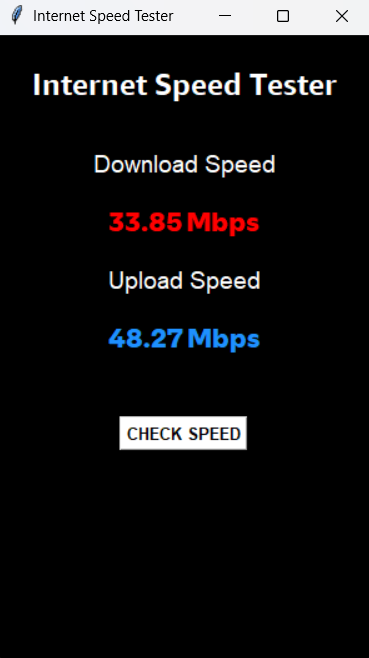

# 🌐 Internet Speed Tester (Python + Tkinter)

A simple and elegant internet speed tester GUI built with **Python** and **Tkinter**, featuring animated real-time speed updates. It uses the `speedtest` module to measure download and upload speeds.

---

## 🚀 Features

- 📶 Measures **Download** and **Upload** speed
- ⚡ Animated speed increase from 0 to final value
- 🎨 Clean GUI using custom fonts
- 💡 "Check Speed" button with status indicator
- 📦 Easy to package as `.exe` with PyInstaller

---

## 🛠️ Requirements

Make sure you have Python installed. Then install the required module:

```bash
pip install speedtest-cli
```
## ▶️ How to Run
```bash
python internet_speed_tester.py
```
## 📸 GUI Preview

